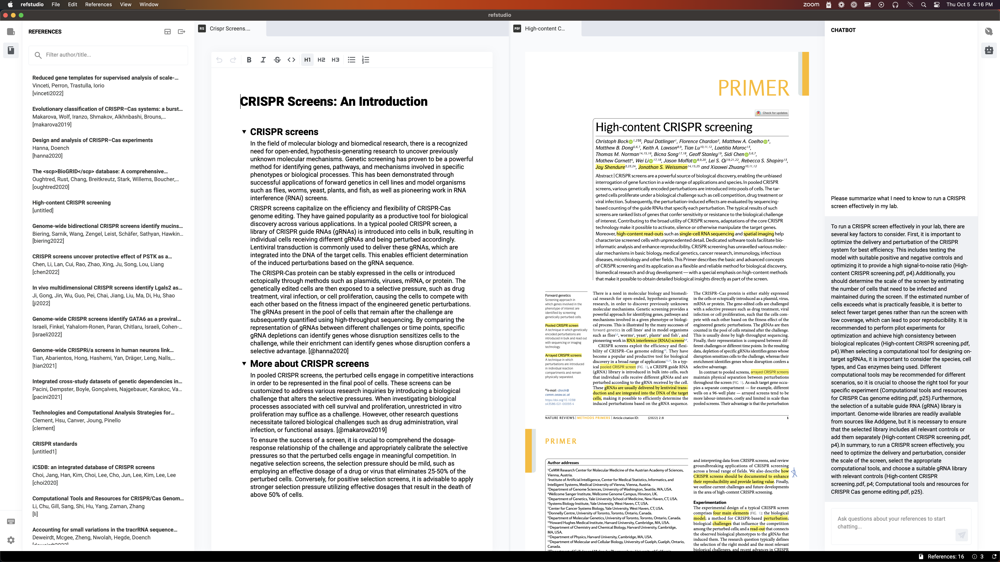

<p align="center">
  
  <h1> Ref Studio</h1>
  <p>An open source text editor optimized for writing that relies on references.</p>
</p>

<p align="center">
  <a href="https://github.com/refstudio/refstudio/actions/workflows/on-push.yml">
    
  </a>
  <a href="https://codecov.io/gh/refstudio/refstudio" >
   
   </a>
</p>




## Motivation

Foundation model capabilities are rapidly improving and writing support systems are a promising early use case. Because foundation models are better at fluency than factuality, early experiments have focused on creative writing rather than expository, argumentative, or academic writing. Ref Studio will facilitate experimentation with factual writing support systems by providing an open source text editor that integrates foundation models and referenced document contents.

## Features

Ref Studio has three main components focused on writing, references, and AI interactions.

### Writing

The writing component is supported by a text editor with basic styling with Markdown syntax, Notion-like blocks that can be collapsed, re-arranged, and display associated annotation widgets, such as cited references.

### References

References play a crucial role in scientific document writing. Ref Studio offers a built-in feature for managing references. You have the option to upload your PDF references, which will be analyzed and made easily accessible to assist you throughout the writing process. Additionally, Ref Studio provides a dedicated system interface to efficiently manage your references.

### AI Interactions

When editing documents you can ask AI assistance to rewrite parts of the text, and get answers using the chat. Additionally you can also ask for text completion in the editor.

## Demo

https://github.com/refstudio/refstudio/assets/174127/f8b847e1-d6b7-4e58-ae04-0d8e96c88382

## Setup & Run

### Prerequisites (development)

- JavaScript: [node.js](https://nodejs.org/en/download) (>= 18.12.0 LTS) and [Yarn](https://yarnpkg.com/getting-started/install) package manager
- Python: (>= 3.11) and [Poetry](https://python-poetry.org/docs/#installation) package manager
- Tauri: Check [prerequisites](https://tauri.app/v1/guides/getting-started/prerequisites/) to install Rust and [Cargo](https://doc.rust-lang.org/stable/cargo/) package manager

### Backend (Python sidecar)

Once you have poetry installed, you can install the Python dependencies via:

```bash
poetry install
```

To compile the Python sidecar as a binary:

```bash
yarn python
```

This will generate the binary at `src-tauri/bin/python` and append the appropriate [target triple](https://tauri.app/v1/guides/building/sidecar) required by Tauri.

You can read more details about the Python backend implementation [here](/python/README.md).

### Frontend

To install the frontend application built with Tauri and Vite + TypeScript you can run:

```bash
yarn install
```
#### Desktop (Tauri + Sidecar python)

You should be able to launch the desktop using:

```bash
yarn tauri:dev
```

To automatically open the browser devtools you can launch the app via:

```bash
$ yarn tauri:dev:debug
```


#### Web (Vite + HTTP python backend)

You should be able to launch the web app by running the API and the development server (using Vite):

```bash
yarn web:api
```

You can access the HTTP python backend at http://127.0.0.1:8000. The API documentation is available at http://127.0.0.1:8000/api/sidecar/docs.


```bash
yarn web:dev
```

You open the web application at http://localhost:1421/ in your browser.


### Logs

You can find logs from the Python sidecar in `/tmp/refstudio-sidecar.log`.

## Unit tests

### Backend (Python)

Assuming you are in the root project directory, you can run the Python tests and generate a coverage report by:
```bash
poetry run pytest --cov=python python/tests
```

### Frontend (TypeScript)

```bash
yarn install
```

Assuming you are in the root project directory, you can run one of the following scripts

```bash
yarn test
yarn test:watch
yarn test:watch:ui
```

## Reset

To **completely** reset your local environment you should following these steps:

* run `./scripts/reset_refstudio.sh` (also available via `yarn reset:storage`)
* run `yarn install && poetry install && yarn python` to make sure both the FE and BE are up-to-date
* run `yarn tauri:dev` (or `yarn web:api` and `yarn web:app`) to run the app
* run the application and create a new project
* (extra) you might also need to remove the [application's local storage cache](https://developer.chrome.com/docs/devtools/storage/localstorage/) for browser and Tauri browser

Notes:
* Project state is persisted in the backend storage folder that defaults to `/tmp/web-storage-url`
* The `reset_refstudio.sh` reset script will remove the folder `user1` from the backend storage folder
* The reset script will backup the `user1/settings.json` to `user1.settings.json.bak`
* You can use the env `WEB_STORAGE_URL` if the folder is located in a diferent folder (ex: `WEB_STORAGE_URL=/some/path reset_refstudio.sh`)

## Versioning

This project version convention is based in a [Calendar Versioning](https://www.cockroachlabs.com/blog/calendar-versioning/) [scheme](https://calver.org/).

You should follow the general pattern:

* `YY.N.PATCH[-PRE_RELEASE]`

So the first version is `23.1.0` and a new release, in the same year, would be `23.2.0`, while a patch for the first version your be `23.1.1`. The first release of 2024 would be `24.1.0`.

You can also append a pre-release tag using [semantic version](https://semver.org/spec/v2.0.0-rc.1.html#spec-item-10) rules by appending a dash and a series of dot separated identifiers (ex: `23.2.0-rc.1`).

## Release

### Remote (GitHub Action)

To release a new version use the following steps:

- update `package.json` with a new version following the [versioning](#versioning) rules.
- run the [Cut Release workflow](https://github.com/refstudio/refstudio/actions/workflows/cut-release.yml) by pressing "Run workflow" and select the branch (should be `main` or a release PR).
- open the [draft release](https://github.com/refstudio/refstudio/releases) created in the previous step
- download and test the Ref Studio application
- edit release notes to include notable changes and instalation instructions
- publish release

### Locally

You can also create a new Ref Studio release (ex: mac `.dmg` image files) locally using the following steps:

- `yarn python` to ensure the backend python server binary is buit.
- `yarn tauri:build` to build all the supported binary files.

If you are interested only on a specific target, you should run:
- `yarn tauri:build:mac:apple` to get Apple silicon binary.
- `yarn tauri:build:mac:intel` to get Intel-based mac binary.
- `yarn tauri:build:mac:universal` to get a Universal macOS Binary (runs on both Apple silicon and Intel-based Macs).

After the build you can find the `.dmg` binaries in the `/binaries` folder.
